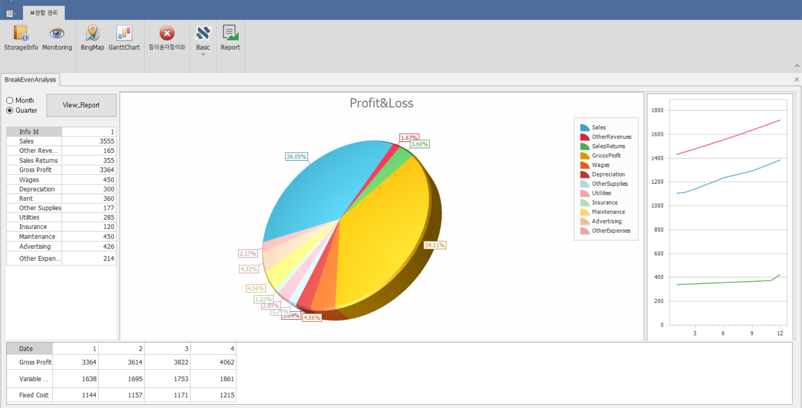
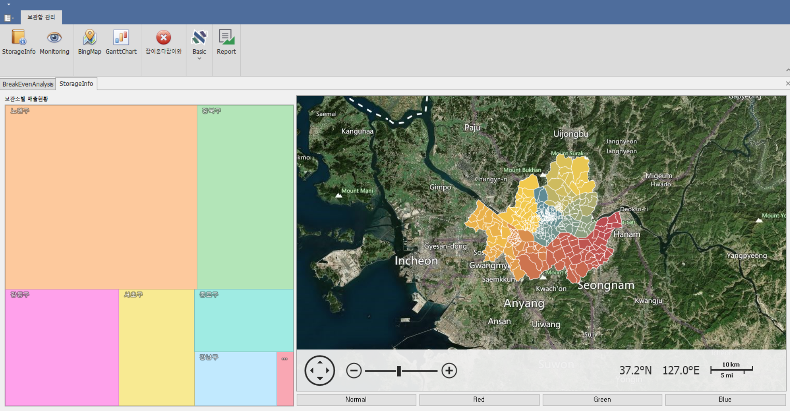

# StorageERP(v1.0.0) : 

# 개요
- 범용적으로 사용하는 물품 보관 시스템 ERP
- Web API를 이용한 분산컴퓨팅 기술 적용

# 개발 기간
- 2020년 12월 14일 ~ 2020년 12월 21일 (2차 Mini Project)

# 구성원
- 양석원, 양창혁, 이주형, 임동희

# 기능 목록

## 관리자용 프로그램

### 1. 관리자 메인 화면

- 좌측 상단 버튼으로 월별/분기별 분석 선택 가능
- View_Report 버튼을 누르면 출력 가능한 형태의 report 생성 가능
- 하단 grid view에는 총 수입, 고정 비용, 변동 비용을 출력, 같은 내용이 우측 chart에 표현됨
- 하단 view의 날짜를 누르면 좌측 view와 pie chart에 상세 내용 출력
- 상단 report 버튼으로도 해당 form을 부를 수 있음.
### 2. BingMap 화면

- 서울내에 보관함의 위치를 MapPushPin을 사용하여 BingMap에 나타낸다.
- MapPushPin에 마우스를 가져다대면 ToolTip으로 간단한 정보가 나타난다.
- MapPushPin을 클릭하면 상세 정보가 나타난다.

### 3. GanttChart 화면

- 보관소 위치별 보관함 사용 현황을 알 수 있다.
- 일반 / 신선 함별로 또는 기간별로 필터가 가능하다.

### 4. Monitoring 화면

- 보관소 내 온도, 습도, 진동을 실시간으로 파악할 수 있다.

### 5. Storage Info 화면

- 좌측 tree map은 지역별 보관함 이용 획수를 크기로 형상화해 표현
- 우측 map control은 지역별로 구분해 표현.
- 하단 버튼을 통해 지역별 색상 변경 가능

# 사용 기술

## 언어

- C# 8.0

## 프레임워크

- .Net FrameWork 4.8
- EntityFrameWork 6.4
- Winform
- DevExpress v20.2

## 데이터베이스

* MSSQL Server 2019

## 기타 개발환경

- Windows 10
- Microsoft Visual Studio Community 2019 v16.8
- Microsoft SQL Server Management Studio v18.6

# 데이터베이스 스키마

- FakeAccountInfo 테이블을 제외하고 모두 제3정규화까지 완료함.

# UML

## 클래스 다이어그램

## User Case Diagram

## 순서도

# Point of Interest

# Pie chart에 data입력이 안되는 문제 [#15](https://github.com/snrbs17/StorageERP/issues/15)

## 증상
- GridView와 같은 방식으로 DataSource에 list를 넣었으나 출력되지 않음

## 원인
- Pie chart에는 string 변수와 double 변수가 쌍을 이루는 값이 여러개 입력되어야 함

## 결과
~~~
        var list = Dao.Dao.fakeAccountInfo.GetInfoReorganized().ToList();

        chartControl2.Titles.Add(new ChartTitle() { Text = "Profit&Loss" });
        chartControl2.Series[0].DataSource = DataPoint.GetDataPoints(list[0]);
        chartControl2.Series[0].ArgumentDataMember = "Argument";
        chartControl2.Series[0].ValueDataMembers.AddRange(new string[] { "Value" });
        chartControl2.Series[0].LegendTextPattern = "{A}";

        public class DataPoint
        {
            public string Argument { get; set; }
            public int Value { get; set; }

            public static List<DataPoint> GetDataPoints(InfoReorganized info)
            {
                return new List<DataPoint> {
                new DataPoint { Argument = "Sales", Value = info.Sales},
                new DataPoint { Argument = "OtherRevenues", Value = info.OtherRevenues},
                new DataPoint { Argument = "SalesReturns", Value = info.SalesReturns},
                new DataPoint { Argument = "GrossProfit", Value = info.GrossProfit},
                new DataPoint { Argument = "Wages", Value = info.Wages},
                new DataPoint { Argument = "Depreciation", Value = info.Depreciation},
                new DataPoint { Argument = "OtherSupplies", Value = info.OtherSupplies},
                new DataPoint { Argument = "Utilities", Value = info.Utilities},
                new DataPoint { Argument = "Insurance", Value = info.Insurance},
                new DataPoint { Argument = "Maintenance", Value = info.Maintenance},
                new DataPoint { Argument = "Advertising", Value = info.Advertising},
                new DataPoint { Argument = "OtherExpenses", Value = info.OtherExpenses}
                };
~~~
- 공식 문서를 참고하여 해결.
- DataSource외에 argumen와 value가 필요함.

# Data Analysis시 기본값이 제대로 출력되지 않는 문제 [#8](https://github.com/snrbs17/StorageERP/issues/8)

## 증상
- Groupby 함수로 묶인 class들의 property 총합을 구할 수 없는 문제

## 원인
- Class들이 collection으로 묶여 있어 property를 추출해내기 어려움

## 결과
- Groupby 후 select 단계에서 lambda식을 이용해 계산
~~~
var value = Clients.FakeAccountInfoes.GetFakeAccountInfoesAsync().Result
.GroupBy(x => x.Date.Day, x => x,
(day, info) => new {Info.Sum(x => x.Sales)}
~~~

# BingMap MapPushPin ToolTip 좌표값 문제 [#16](https://github.com/snrbs17/StorageERP/issues/16)

## 증상
- MapPushPin을 runtime에 추가해주고 그 위에 마우스를 가져다대면 Tooltip이 떠야하나 좌표값이 맞지않아 다른 위치에서 뜬다.

## 원인
- BingMap이 runtime 후 좌표가 안맞는걸로 사료됨(정확하게 못찾음)

## 결과
- 따로 Tooltip을 추가하지않고 애초에 mapPushPin의 메서드로 toolTip을 찾아서 사용하였더니 위치가 서로 맞았다.

