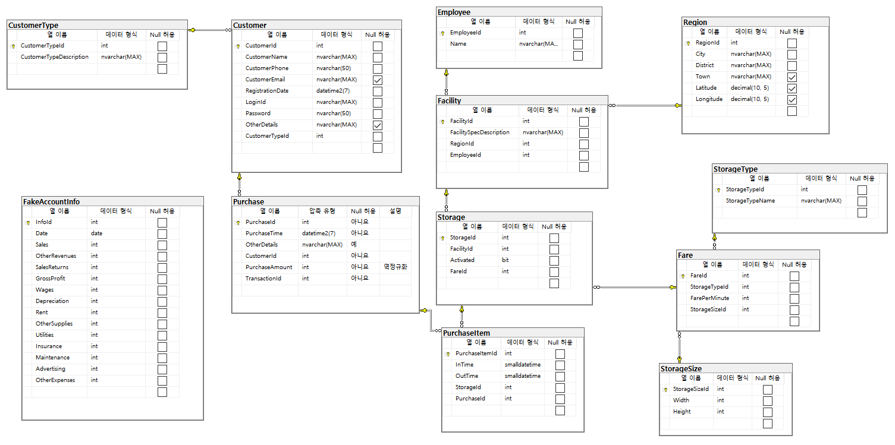

# StorageERP(v1.0.0) : 

# 개요
- 범용적으로 사용하는 물품 보관 시스템

# 개발 기간
- 2020년 12월 14일 ~ 2020년 12월 21일 (2차 Mini Project)

# 구성원
- 양석원, 양창혁, 이주형, 임동희

# 기능 목록

## 관리자용 프로그램

### 1. 관리자 메인 화면

- 연간/월간 수입을 월별/일별로 구분하여 시각화한다.
- 보관함의 종류별로 구분하여 시각화 가능하다.
- Storage Activate/Deactivate를 통해 보관함의 활성화 여부를 실시간 업데이트 가능하다.

### 2. BingMap 화면

- 서울내에 보관함의 위치를 MapPushPin을 사용하여 BingMap에 나타낸다.
- MapPushPin에 마우스를 가져다대면 ToolTip으로 간단한 정보가 나타난다.
- MapPushPin을 클릭하면 상세 정보가 나타난다.

### 3. GanttChart 화면

- 보관소 위치별 보관함 사용 현황을 알 수 있다.
- 일반 / 신선 함별로 또는 기간별로 필터가 가능하다.

### 4. Monitoring 화면

- 보관소 내 온도, 습도, 진동을 실시간으로 파악할 수 있다.

# 관리 항목

### 1. 보관함 정보

- 현재 보관함 상태에 따라 활성화/비활성화를 선택할 수 있다.
### 2. 관리자용 정보

- 월간/연간 매출액 추이를 그래프로 확인할 수 있다.
- 보관함 종류에 따라 데이터를 구분해 시각화할 수 있다.

# 사용 기술

## 언어

- C# 8.0

## 프레임워크

- .Net FrameWork 4.8
- EntityFrameWork 6.4
- Winform
- DevExpress v20.2

## 데이터베이스

* MSSQL Server 2019

## 기타 개발환경

- Windows 10
- Microsoft Visual Studio Community 2019 v16.8
- Microsoft SQL Server Management Studio v18.6

# 데이터베이스 스키마

- Purchase 테이블의 PurchaseAmount 항목은 역정규화한 결과이다.

- 이외의 모든 항목이 제 3 정규화까지 완료됐다

# UML

## 클래스 다이어그램

## User Case Diagram

## 순서도

# Point of Interest

# Data Analysis시 기본값이 제대로 출력되지 않는 문제 [#11](https://github.com/snrbs17/StorageERP/issues/11)

## 증상
- TimeScope를 Yearly로 설정한 후 바로 Search를 누를 경우 잘못된 값이 출력됨

## 원인
- Form 전체에 default값이 Monthly TimeScope 11월을 기준으로 설정되어 있음

## 결과
- TimeScope 설정이 바꿨을 때 default값이 새로 지정되도록 함수의 위치를 변경

# BingMap MapPushPin ToolTip 좌표값 문제 [#16](https://github.com/snrbs17/StorageERP/issues/16)

## 증상
- MapPushPin을 runtime에 추가해주고 그 위에 마우스를 가져다대면 Tooltip이 떠야하나 좌표값이 맞지않아 다른 위치에서 뜬다.

## 원인
- BingMap이 runtime 후 좌표가 안맞는걸로 사료됨(정확하게 못찾음)

## 결과
- 따로 Tooltip을 추가하지않고 애초에 mapPushPin의 메서드로 toolTip을 찾아서 사용하였더니 위치가 서로 맞았다.

